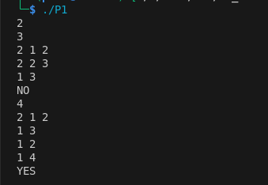

<!-- Student: **Pema Dolker**  
Course: CSF 303   
Semester: SS2026

# Practical 2 analysis 

#  Problem 1: Dinner Table Arrangements

##  Summary of the problem

In this problem, we need to arrange friends around a circular table such that no two adjacent people share a common allergy. Each person’s allergies are given, and we must check if a valid arrangement exists.

## Explanation of the algorithm 

I converted each person’s allergies into a **bitmask** so that I could quickly check compatibility using bitwise AND. Then I used **backtracking** to try all possible arrangements of people. At each step, I only placed a person if they were compatible with the previous one. Finally, I also checked the first and last person to ensure the circular condition.



## Time Complexity

```text
O(N!)
```

Since we try all permutations in the worst case.

##  Space Complexity

```text
O(N)
```

Used for recursion stack and tracking visited people.

##  Reflection

This problem was my first time properly using bitmasking. At first it was confusing, but once I understood how allergies can be represented as bits, checking compatibility became very easy. I also got more comfortable with recursion and backtracking.

---

#  Problem 2: Maximum AND Subarray

##   Summary of the problem

We are given an array and need to find the maximum AND value of any subarray of size K.

##  Explanation of the algorithm 

Instead of checking all subarrays, I built the answer bit by bit starting from the most significant bit. For each bit, I checked if there exists at least K consecutive numbers that contain that bit. If yes, I kept that bit in the answer.


##  Time Complexity

```text
O(N × 32)
```

##  Space Complexity

```text
O(1)
```

##  Reflection

This problem helped me understand how to think in terms of binary and bits. Initially, I tried brute force, but it was too slow. The bit-by-bit approach was new to me and felt tricky, but after practicing with examples, it made sense.

---

#  Problem 3: Sliding Window Maximum

##   Summary of the problem

Given an array and a window size K, we need to find the maximum element in each sliding window.

##  Explanation of the algorithm 

I used a **deque** to store indices of useful elements. While processing the array, I removed elements that were outside the window and also removed smaller elements from the back since they are not useful anymore. The front of the deque always gives the maximum.


##  Time Complexity

```text
O(N)
```

##  Space Complexity

```text
O(K)
```

##  Reflection

At first, I used a brute force approach (checking each window), but it was inefficient. Learning how a deque can maintain the maximum efficiently was very helpful. This problem improved my understanding of optimizing sliding window problems.

---

#  Problem 4: Sliding Window Maximum with Updates

##   Summary of the problem

This is an extension of the previous problem, but now the array can be updated, and we must still answer maximum queries efficiently.

##  Explanation of the algorithm 

Since the array changes dynamically, I used a **segment tree** to support fast updates and range maximum queries. Each query and update is handled in logarithmic time.


##  Time Complexity

```text
O((N + Q) log N)
```

##  Space Complexity

```text
O(N)
```

##  Reflection

This was my first time working with segment trees, and it was quite challenging. Understanding how the array is divided into segments and how queries work recursively took some effort, but it was a good learning experience.

---

#  Problem 5: Network Latency

##   Summary of the problem

We are given a network of routers and need to find the minimum time to send data from router 1 to router N.

##  Explanation of the algorithm 

I used **Dijkstra’s algorithm** with a priority queue. The idea is to always process the node with the smallest current distance and update its neighbors accordingly.


##  Time Complexity

```text
O((N + M) log N)
```

##  Space Complexity

```text
O(N + M)
```

##  Reflection

This problem helped me understand shortest path algorithms better. I had seen Dijkstra before, but implementing it myself made things much clearer, especially how the priority queue works.

---

# Problem 6: The Shortest Path with Toll Booths

##  Summary of the problem

We need to move from the first booth to the last one using coins. At each booth, we can either pay the toll or skip it (limited skips). The goal is to minimize total time.

## Explanation of the algorithm 

I treated this as a **shortest path problem with states**. Each state includes position, coins left, and skips used. I used a **priority queue (Dijkstra)** to always process the minimum time state. From each state, I explored two options: pay or skip, updating time accordingly.


##  Time Complexity

```text
O((N × M × K) log(N × M × K))
```

##  Space Complexity

```text
O(N × M × K)
```

##  Reflection

<!-- This was the hardest problem for me. I initially tried BFS, but it gave wrong answers because the costs were different. After switching to Dijkstra and fixing my mistakes, it finally worked. This problem really helped me understand when BFS is not enough and why weighted shortest path algorithms are needed. -->

<!-- 
Overall, these problems covered a wide range of topics, from simple arrays to advanced data structures and graph algorithms. Some problems were quite challenging at first but working through them step by step helped me improve my understanding and confidence in problem solving. I also learned the importance of choosing the right algorithm for each problem instead of forcing one approach.
 --> 
