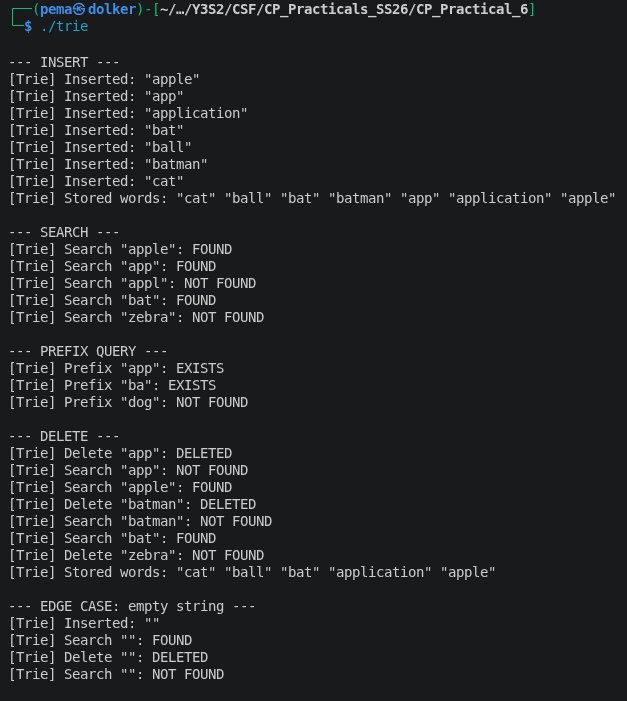
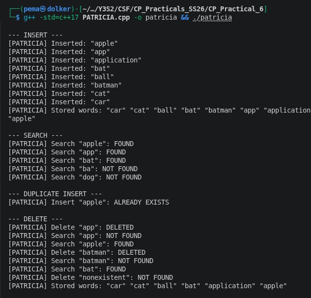
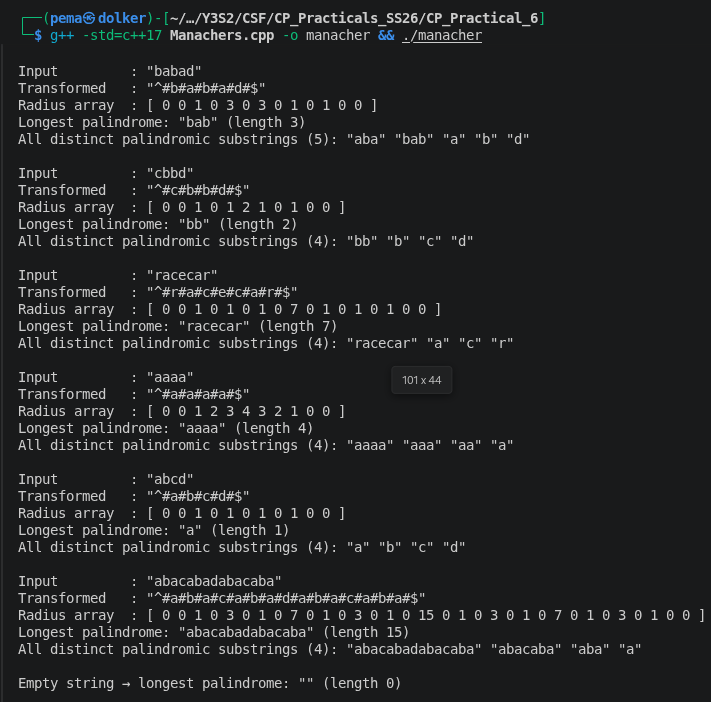

# CP Practical 6 - String Algorithms

## 1. Basic Trie

### What I Implemented

A Trie (also called a prefix tree) is a tree structure where every path from the root to a marked node spells out a stored word. Each node does not store a full word - it only stores its children (one per distinct character that branches off at that point) and a boolean `is_end_of_word` flag that marks whether a complete word ends there.

I implemented the following operations in `trie.cpp`:




**Insert - O(L)**
I walk the word character by character from the root. If a child node for the current character does not exist, I create one. Once all characters are consumed, I set `is_end_of_word = true` on the last node. The important thing here is that shared prefixes are stored only once - inserting "app" and "apple" reuses the same first three nodes, with a second end-marker placed at the 'p' node.

**Search - O(L)**
I walk down the tree following each character. If at any point a child is missing, I immediately return false. After consuming all characters, I check `is_end_of_word` - this is what distinguishes a stored word from a prefix that just happens to exist in the tree. For example, "appl" returns NOT FOUND even if "apple" is stored, because no end-marker sits at the 'l' node.

**Prefix Query - O(L)**
This is the same as search but without checking `is_end_of_word` at the end. This is actually the key advantage a Trie has over a hash set - prefix lookups come for free. A hash set can only tell you whether an exact word exists; a Trie can tell you whether any stored word starts with a given prefix in O(L) time.

**Delete - O(L)**
This was the most complex operation. I used recursive post-order traversal, which means the recursion goes all the way to the target node and then works backwards on the way up. The function returns two values: whether the deletion succeeded, and whether the current node can now be freed (i.e. it has no children left and is not the end of another word). This pruning step is what keeps the tree compact - deleting "batman" should free the 'm','a','n' nodes but leave the "bat" node untouched.

### The Tricky Part
The hardest thing was getting the delete function to correctly separate two different concerns: "did the deletion succeed?" and "should this node be freed?". I initially returned a single `bool` for both, which caused a bug where deleting "app" from a tree that still contained "apple" was reported as failed - because the 'p' node could not be pruned (it had "apple" as a child), I incorrectly treated that as a failure. The fix was to return a pair of booleans.

### Key Insight
A Trie trades memory for speed on prefix operations. Where a hash set does O(1) exact lookup but cannot do prefix queries efficiently, a Trie does O(L) for everything but makes prefix search trivial. This is why Tries are used in autocomplete systems, spell checkers, and IP routing tables.

---

## 2. PATRICIA Trie (Radix Tree / Compressed Trie)

### What I Implemented

A standard Trie creates one node per character. When words share long prefixes or when a branch has only one child for many levels, this produces long single-child chains that waste memory and add unnecessary traversal steps. PATRICIA (Practical Algorithm To Retrieve Information Coded In Alphanumeric) fixes this by compressing those chains.

Instead of one node per character, each **edge** in a PATRICIA Trie stores a string label - the full sequence of characters along that path before the next branching point. A node only exists where a real branch occurs. This means the tree has at most as many nodes as there are stored words.

**Example - inserting "apple", "app", "application":**

```
Standard Trie:
  root → a → p → p[end] → l → e[end]
                         → i → c → a → t → i → o → n[end]

PATRICIA Trie:
  root ──"app"──► node[end]
                    ├──"le"──► node[end]         ("apple")
                    └──"lication"──► node[end]   ("application")
```

I implemented the following operations in `PATRICIA.cpp`




**Insert - O(L)**
There are three cases when inserting at any node:
- **Case A:** No edge starts with the next character → create a new leaf edge carrying the full remaining suffix.
- **Case B:** An edge's label is fully consumed before the word ends → recurse into the child node.
- **Case C:** The edge label and the word partially match then diverge → **split the edge**.

Edge splitting is the defining operation of a PATRICIA Trie. For example, if "batman" is already stored and I insert "ball", they share "ba". The "batman" edge gets split into a "ba" edge leading to a new mid-node, which then has two children: a "tman" edge (old) and an "ll" edge (new). I compute the shared prefix length using a helper function `common_prefix_len` and then rewire the pointers accordingly.

**Search - O(L)**
I walk the tree consuming the word through edge labels. At each node I find the edge whose label starts with the next character, compute how much of the label matches the word, and recurse. If the label does not fully match, the word is not stored. If all characters are consumed, I check `is_end` on the landing node.

**Delete - O(L)**
After finding and clearing the `is_end` flag, I clean up in two steps on the way back up the recursion:
- **Prune:** if the deleted node is now a childless leaf, remove it from its parent entirely.
- **Merge:** if the parent now has exactly one child and is not itself a word end, the two edges can be collapsed into one - the reverse of splitting. This is what keeps the tree compact after deletion.

### The Tricky Part
Edge splitting requires carefully updating three things at once: the existing edge label (truncated to just the shared prefix), a new mid-node that takes over the old child, and the new word's suffix attached to that mid-node. Getting the order of pointer updates wrong corrupts the tree silently. I found working through a concrete example on paper before writing the code was essential.

### Key Insight
PATRICIA is more memory-efficient than a standard Trie because node count is proportional to the number of stored words, not the total number of characters. In a standard Trie, a word like "application" alone creates 11 nodes. In PATRICIA, it creates at most one edge. This is why PATRICIA and its variants are used in production systems like Linux's routing table and some database index structures.

---

## 3. Manacher's Algorithm

### What I Implemented

Manacher's Algorithm finds the longest palindromic substring of a string in O(n) time. The naive approach - expand around every possible centre - costs O(n²) because each expansion can take O(n) steps.

I implemented the full algorithm in `Manacher.cpp`, including:



- `compute_radii()` - the core algorithm producing the radius array
- `longest_palindrome()` - finds and returns the longest palindromic substring
- `all_palindromes()` - collects every distinct palindromic substring
- `explain()` - prints the transformed string, the full radius array, and the results (useful for seeing the algorithm's internal state)

**Step 1 - String transformation**
I insert a `#` character between every character of the input, and add sentinel characters `^` and `$` at the boundaries. This converts the string "aba" into "^#a#b#a#$". The effect is that every palindrome - whether originally even or odd length - becomes odd-length in the transformed string, so the algorithm only needs one expansion case instead of two.

**Step 2 — Computing the radius array**
I maintain an array `p[]` where `p[i]` is the radius of the longest palindrome centred at transformed position `i`. I also track the rightmost palindrome found so far using its centre `c` and right boundary `r`.

For each position `i`, if `i` falls inside the known rightmost palindrome (i.e. `i < r`), I can reuse the already-computed result for the mirror position `j = 2c - i`:
```
p[i] = min(r - i, p[j])
```
This gives a guaranteed minimum radius without any character comparisons. I then try to expand beyond that. If the expansion pushes the right boundary further, I update `c` and `r`.

**Step 3 — Mapping back to the original string**
After computing `p[]`, I find the maximum radius and map it back to the original string. A transformed-string centre `i` with radius `p[i]` corresponds to a substring starting at `(i - p[i]) / 2` with length `p[i]` in the original string.

### The Tricky Part
The index mapping from the transformed string back to the original was the most confusing part. The `#` characters double the length of the string, which means transformed indices are roughly double the original ones. Working through the formula `start = (i - p[i]) / 2` with a specific example - say "racecar" - made it click: the transformed centre for the whole palindrome is at index 8 in "^#r#a#c#e#c#a#r#$", and (8 - 7) / 2 = 0, which is the correct start index in the original.

### Key Insight
The reason this is O(n) and not O(n²) comes from the mirror reuse. The right boundary `r` only ever moves to the right - it never decreases. Every time a character comparison happens during expansion, either `r` advances (so those comparisons are "paid for" by a future position that gets to skip them), or the expansion stops immediately. The total number of comparisons across the entire algorithm is therefore bounded by O(n).

---

## Overall Reflection

**Comparison of Trie and Patricia**: Tries are relatively simple to work with - each node has one character (edge) and a flag indicating whether this edge is the last character in the word. Patricia is much more compact than Tries because it does not require one node per character. While Patricia has the same time complexity - O(L) - to perform insert, remove, and search for a word, in practice it uses much less memory than Tries because it reduces single-child nodes into a single node.

**The most complex operation to perform in both structures**: Deletion of a word. The deletion operation in Tries returns two boolean values instead of just one. The deletion operation in Patricia requires either merging nodes (which is the reverse of splitting) or expanding the size of the last node so that Patricia remains compact. In either case, deleting an edge from these structures is not a simple recursive call, and requires an understanding of what invariants must maintain after the word has been deleted.

**Finding palindromes, naive vs Manacher's**: Until Manacher's algorithm was implemented, finding all palindromes in a string required inspecting each of the O(n) center points and comparing the original string to the center point until a character on either side of the center point failed to match. This resulted in an overall time complexity of O(n^2) for finding palindromes. The mirror re-use concept used in Manacher's algorithm is one example of a common principle of algorithm design: if something has already been calculated, find a way to re-use it rather than recalculate it. The `p[]` array keeps track of previously computed palindrome lengths.


We manage memory manually by using `new` and `delete` which makes it more difficult to delete objects than if a garbage collector was involved. Both the recursive pruning operation on a Trie and the merge operation in PATRICIA required careful tracking of which pointers are still alive at the end of the recursion in order to know which ones to delete. This is a valuable skill for anyone who does systems programming, as it gives you a better understanding of objects' lifetimes than you would get from letting the runtime handle this for you.